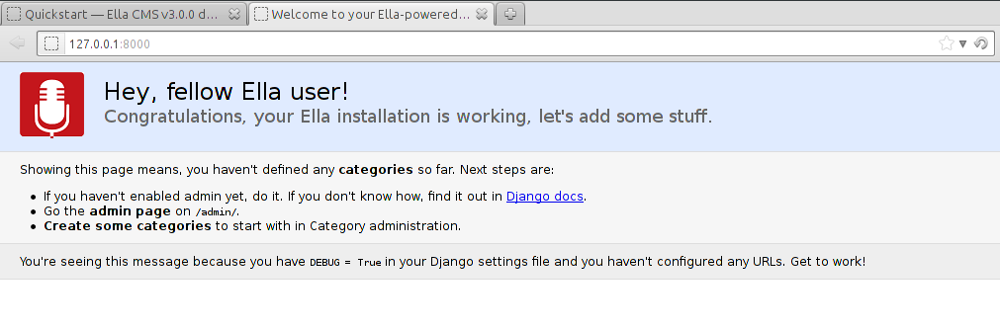

.. _tutorial:

Quickstart
##########

Setting up Ella
***************

This tutorial will guide you through the process of creating and deploying your
first Ella-based site. Since Ella is a CMS, we will create a blog. This first step
will take us through setting up our environment, installing all the dependencies
and kicking off the project. Before you dive into it, we suggest you go
through the official `Django tutorial`_ to get yourself familiar with Django
since we will be relying on that.

Dependencies
============

We assume that ``python``, ``setuptools`` and ``python-imaging`` (``PIL``) are
installed on your system directly since they can be non-trivial to install the
python way. We will be working with `pip`_ and `virtualenv`_ which are great
tools for any Python project.

.. note::
    We will not cover any version control, but we strongly advise you use some
    (we prefer `GIT`_) to keep track of your emerging project.

First we need to install ``virtualenv`` (under root):

.. code-block:: bash

    easy_install virtualenv

Now we can create and activate a virtualenv where our project and all related
code will reside:

.. code-block:: bash

    virtualenv ella_sandbox
    source ella_sandbox/bin/activate

Next, install Ella into your fresh virtualenv. Ella has all it's dependencies
covered in it's setup, so it's fairly sufficent to run following command
using ``pip``:

.. code-block:: bash

    pip install ella
    
After these steps, everything required is ready and we can create a new Django
project using Ella in standard `Django`_ way:

.. code-block:: bash

    mkdir ellablog
    cd ellablog
    django-admin.py startproject ellablog

.. _Django: http://www.djangoproject.com
.. _Django tutorial: http://docs.djangoproject.com/en/dev/intro/tutorial01/
.. _pip: http://pip.openplans.org/
.. _virtualenv: http://pypi.python.org/pypi/virtualenv
.. _GIT: http://git-scm.com/

``settings.py``
===============

Our first step in actual code will be adding Ella to your project's
``INSTALLED_APPS`` along with some required settings, the resulting values
(unchanged values are omitted) should look similar to this::

    ...
    INSTALLED_APPS = (            
        'django.contrib.admin',   
        'django.contrib.auth',    
        'django.contrib.contenttypes',
        'django.contrib.sessions',
        'django.contrib.sites',   
        'django.contrib.redirects',
                                
        'ella.core',
        'ella.photos',
        'ella.articles',
    )
    ...

In order to create our new blog, we are gonna need some HTML templates showing
post listings, post details, hompage etc. Therefore, we have to tell
Django, where to look for those templates. This settings are kept in
``settings.py`` contained in root of our project. Second, we need to specify
a directory + URL used to serve media files from:

.. note:: 
    Media files and static files are not the very same thing.
    We consider media files those, that are **uploaded dynamically by users**,
    e.g. main article photos. On the other hand, static files usually don't
    change and their common representatives include CSS styleseets, JS sources
    etc.

.. code-block:: python

    from os.path import join, dirname
    
    PROJECT_ROOT = dirname(__file__)

    # set the templates directory
    TEMPLATE_DIRS = ( 
        join(PROJECT_ROOT, 'templates'),
    )
    
    # give Django media settings
    MEDIA_ROOT = join(PROJECT_ROOT, 'media')
    MEDIA_URL = '/media/'

This will tell Django, that it should look for the templates in directory
``templates`` which is located in the root of the project directory. And
store the media in ``PROJECT_ROOT/media/`` directory.

``urls.py``
===========

Last thing to configure is the URL mappings. We want to include ``ella.core.urls``
which handle all the Ella magic but also create some mappings that will
serve our static files (and static files for admin) in the development server.
Note that these patterns for static files will work only when ``DEBUG`` mode
is turned on since it would be rather inefficent in production (for more on
this topic, see `Managing static files`_ section in Django docs). In similar
fashion, serve also media files discussed in previous paragraph::
    
    from django.conf.urls.defaults import *
    from django.conf import settings
    from django.contrib import admin 
    from django.contrib.staticfiles.urls import staticfiles_urlpatterns

    # register apps for Django admin and let the apps do any initialization they need
    from ella.utils.installedapps import call_modules
    call_modules(('admin', 'register', ))
    
    urlpatterns = patterns('',)
    
    # actual URL mappings
    urlpatterns += patterns('',
        # serve media files
        (r'^%s/(?P<path>.*)$' % settings.MEDIA_URL, 'django.views.static.serve', { 'document_root': settings.MEDIA_ROOT, 'show_indexes': True }),
        
        # run Django admin
        (r'^admin/', include(admin.site.urls)),
        
        # enable Ella
        (r'^', include('ella.core.urls')),
    ) + staticfiles_urlpatterns()

.. note::
    Instead of calling ``admin.autodiscover`` we are using Ella's
    ``call_modules`` which is a more generic version of the same thing. and
    allows us to load additional modules - namely ``register.py`` where, by
    convention all Ella apps put the codethey need for their initialization
    (connecting signal handlers, registering :ref:`custom
    urls<plugins-overriding-publishable-urls>` etc.)
    
.. _Managing static files: https://docs.djangoproject.com/en/dev/howto/static-files/

Database
========

Last configuration step is the **database settings**. Ella supports all Django
DB backends. Example configuration for MySQL can look like this::

    DATABASES = {
        'default': {
            'ENGINE': 'django.db.backends.mysql',
            'NAME': 'ellablog',
            'USER': 'user',
            'PASSWORD': '',
            'HOST': '',
            'PORT': '',
        }
    }

To make this work, you should make appropriate database by your custom
DB-related tool (such as command-line tool ``mysql`` in Linux-like operating
systems). After creating the database, you can proceed with creating all the
required tables by Django for you (and admin user during this process):

.. code-block:: bash

    python manage.py syncdb

Congratulations, you should have a working Ella project. If you start the
development server by typing:

.. code-block:: bash

    python manage.py runserver

try to load the site's root. If everything worked out, you should get a
welcome screen looking similar to this:

Now when we have a working project, we need to actually create the site in the
admin interface. To use it, go to ``/admin/`` and log in using credentials
you entered when creating your superuser account during the ``syncdb`` command.
While being there we will also create an article - our very first blog post so
that we can actually have something to work with in our templates in the next
step of the tutorial.

.. note::
    If you are impatient to start, just play around with the admin to create
    one instance of ``ella.core.models.Category`` to get the root of the web
    working and then one ``ella.articles.models.Article`` published in that
    category (you might need to create additional model like ``Author`` on the
    way).

First we need some theory on how Ella handles sites, categories and published
objects though.

Ella sites and categories
=========================

Ella was designed to serve several sites from a single database. It does so by
using Django's built-in `sites framework`_. The ``sites`` app creates a
default ``Site`` called ``example.com`` during the ``syncdb`` command. Just
rename the domain name to relevant value and you will have an Ella site,
just empty.

Within sites, Ella organizes content into **categories**. Categories (instances
of ``ella.core.models.Category``) are organized in a tree for each site. Every
site needs to have exactly one what we call `root category` - a category without
a parent. This category then represents the root of the website (``/``).

Categories are represented by their ``tree_path`` - a path of ``slugs`` from
root category, for example with categories layout::

    Ella Blog
        About
        Technology
            Concepts
            Django
                Django applications
            Typical deployment env

the ``tree_path`` values would be:

======================= ======================================
Category                ``tree_path`` attribute
======================= ======================================
Ella Blog
About                   about
Technology              technology
Concepts                technology/concepts
Django                  technology/django
Django applications     technology/django/django-applications
Typical deployment env  technology/typical-deployment-env
======================= ======================================

``Category``'s URL is it's ``tree_path`` (which is what makes the root category
the root of the site) and every post in Ella belongs to one or more categories,
nothing shall exist outside of the category tree.

.. _sites framework: http://docs.djangoproject.com/en/dev/ref/contrib/sites/

``Publishable`` object
======================

The main objective of Ella is **publishing content**. Ella together with it's
:ref:`plugins <plugins>` provides several types of content (``Article``,
``Gallery``, ``Quiz``, ...) and can be easily extended to add more (just define
the model) or used with existing models.

For ease of manipulation and efficiency, all content models inherit from
``ella.core.models.Publishable``. This base class has all the fields needed to
display a listing of the content object (``title``, ``description``, ``slug``,
``photo``), basic metadata (``category``, ``authors``, ``source``).  When using
Ella API you will always receive an instance of the actual class (``Article``)
and not the base class (``Publishable``). If you have access to only a
``Publishable`` instance the ``target`` property will return instance of the
correct class (it holds a reference to it's ``ContentType``).

Information about publication are also kept on the ``Publishable`` model
(attributes ``published``, ``publish_from``, ``publish_to`` and ``static``).
All these information together are used to **create an URL for the object**
which will point to it's detail (e.g. article content). There are **two types**
of publication with slightly different use cases:

* **time-based** has URL containing the date of publishing and should be
  used for objects that have some relevance to date (most of the content
  presumably since Ella was designed to power magazines and news sites). The
  URL of an object published in time-based way will look like::
  
      /category/tree/path/[YEAR]/[MONTH]/[DAY]/[CONTENT_TYPE_NAME]/slug/
      
  so for example::
  
      /about/2007/08/11/ella-first-in-production/
      
* **static** has no date in it's URL and should be used for objects with
  universal validity. URL of statically published objects contains a primary
  key reference to avoid namespace clashes::

        /category/tree/path/[PK]-slug/
        
  for example::
    
        /about/1-ella-first-in-production/

Just setting up publish information for a ``Publishable`` object makes it
visible (starting from ``publish_from``) but doesn't make it appear in any
listing in any ``Category``. For that you need to specify in **which categories
you want it listed**.
    

``Listing`` object
==================

``ella.core.models.Listing`` instances carry the information in which ``Category``
and when should be a publishable object listed - it enables users to list the
object in as many categories as they wish at arbitrary times (but not sooner
that the ``Publishable.publish_from``).

By default, listings in the root category only contain ``Listings`` specifically
targeted there whereas listings for any subcategory also contains all the
listings of it's subcategories. This is a model we found most useful when
working with large sites where the site's homepage needs to be controlled
closely by editors and the interim categories only serve as aggregators of all
the content published in them either directly or via a subcategory.

Creating a site
===============

Now you should have enough information to be able to start exploring the
admin (found on ``/admin/``) and create your own site and it's first post.
You will know that you were succesfull if you manage to create and publish an
article whose URL gives you a ``TemplateDoesNotExist`` exception upon
accessing - that means we are ready to **create some templates**.

.. _tutorial-basic-templates:

Basic templates
***************

Now that we have some sample data to work with we can finally start creating
the templates we need to get the site running.

.. note::
    For more information on what templates Ella uses and what context is passed
    in, have a look at :ref:`reference-templates`.

``page/category.html``
======================

.. highlightlang:: html+django

First we will create a template rendering a category: ``page/category.html``.
This is a default template that will be used for all categories if their
specific template (one with their ``path``) isn't found. The two most important
variables in the context we want to use is ``{{ category }}`` containing the
``Category`` model itself and ``{{ listings }}`` containing a list of
``Listing`` objects for that category ordered by ``publish_from`` and/or
priority.

The basic template will look like::

    <h1>Welcome to category {{ category.title }}</h1>
    
{{ category.description }}

    
        

            <a href="{{ listing.get_absolute_url }}">{{ listing.publishable.title }}</a>
            {{ listing.publishable.description|safe }}
        

    

That will render the category title, description and a list of objects published
in that category. Upon accessing ``/`` you should then see the name of the
category and the article you created in administration.

``page/listing.html``
=====================

This template represents the archive, it gets the same context as
``page/category.html`` and the same code can be used. We will use the same code::

    

``page/object.html``
====================

As with ``page/category.html``, ``page/object.html`` is a fallback template that
will be used for rendering any object if more suitable template isn't found.
In real life we will probably have different templates for different content
types, but to verify the concept and get us started a simple template should
be enough::

    <h1>{{ object.title }}</h1>
    
Published on {{ placement.publish_from|date }} in category: <a href="{{ category.get_absolute_url }}">{{ category }}</a>

    

This template will have access to the actual ``Publishable`` subclass instance
(``Article`` in our case), as opposed to ``page/category.html`` and
``page/listing.html`` which only gets instance of ``Publishable`` by default.

Note the use of ```` templatetag that is used to render **rich-text
fields** (which object.description is) thorought Ella.

Now that we have a set of rudimentary templates, we can try
**doing something useful** with them.

Enhancing templates
*******************

Since Ella is a regular Django application, even it's templates are just plain
Django templates. Therefore we just refer you to `other sources`_ and
:ref:`common-gotchas` section to learn more
about the templating language and it's best practices, we will try to focus 
just on Ella-specific parts.

.. _other sources: http://docs.djangoproject.com/en/dev/#the-template-layer

.. _tutorial-boxes:

Boxes
=====

First change we will make is abstract the rendering of the object listing on
category homepage and archive. To do this, Ella provides a ``Box`` for
individual objects. It's primary use is as a
:func:`templatetag <ella.core.templatetags.core.do_box>`.  Boxes can be rendered
for objects accessible through a variable or through a database lookup::

    
        or
    

What ```` does is a little more then fancy include - it retrieves the
object, find the appropriate template and renders that with object-specific
context. The context can be quite different for an Article or Photo gallery.
Boxes are usually used throughout an Ella site to provide maximum flexibility
in rendering objects and also for embedding objects into rich text fields stored
in the database (in text of an article for example). Some applications (
:ref:`features-positions` for example) also use boxes to represent objects.

To create our first box, we just need to create a template called
``box/listing.html`` containing::

    

        <a href="{{ object.get_absolute_url }}">{{ object.title }}</a>
        
    

And change ``page/category.html`` to use the box instead of manually specifying
the output::

    <h1>Welcome to category {{ category.title }}</h1>
    
{{ category.description }}

    
    
        
    

If you still struggle, why the bloody ``Box`` is used instead of standard
````, keep in mind following advantages:

    * They know **which template to use** with proper **fallback engine**.
    * The provide **class-specific** context so that an Article can have
       different context than Photo.

Template fallback mechanisms
============================

In :ref:`last step <tutorial-basic-templates>` we created a few templates that
should suffice for an entire site based on Ella. In real life you probably
wouldn't want every category and every object to share the same template. Ella
provides a simple mechanism to target your templates more directly.

Let's say that we want to create a specific template for rendering articles,
just create a template called ``page/content_type/articles.article/object.html``
and you are done - next time you visit some article's URL, this template will
get rendered instead of your ``page/object.html``. This template would be a
good place to render the text of an article for example::
    
    
    
        
    

Now if you just define the appropriate block in your ``page/object.html``::

    <h1>{{ object.title }}</h1>
    
Published on {{ object.publish_from|date }} in category: <a href="{{ category.get_absolute_url }}">{{ category }}</a>

    
    
    

You should be able to see your article's text on the web.

Another way you can override your templates is based on ``Category``. For
example if you want to create a custom template for your root category (and
your root category's slug is ``ella-blog``), just create one called
``page/category/ella-blog/category.html``::

    <h1>Welcome to site {{ category.site }}</h1>
    
{{ category.description }}
  
                                    
    
        
    

You will be greeted into the site and not your root category next time you visit
the root of your blog. Just create any subcategory to check it will remain
unaffected.

You can use the same simple mechanism (creating new templates) to change the look
of your boxes for individual objects as well.

.. note::
    For more detailed explanation of all the possible template names, have a
    look at :ref:`reference-views`, :ref:`reference-templates`
    and :ref:`reference-templatetags` documentation.

