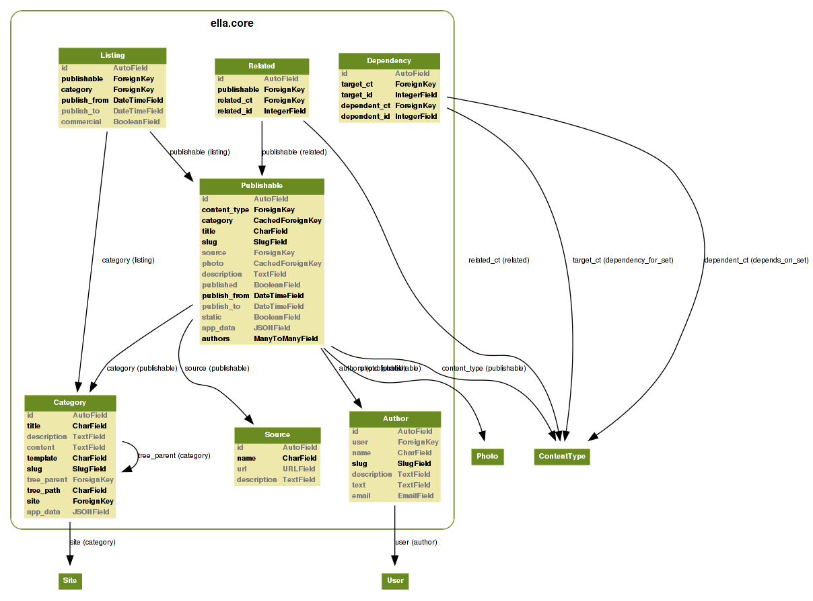
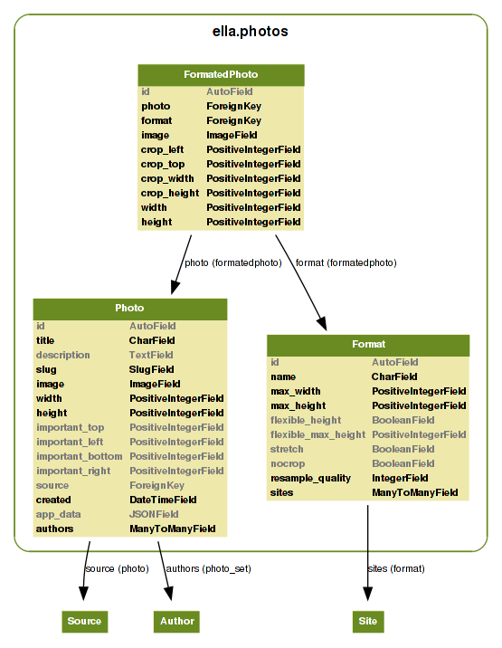
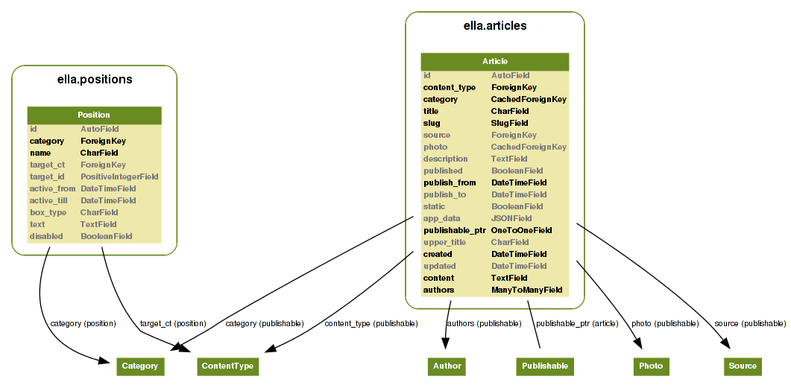

.. _reference-models:

Models
######

Ella core module consist of four apps, two of them contain the main logic and
the second two provide basic CMS capabilities. The core logic is provided by
``ella.core`` and ``ella.photos`` applications, see the image below for quick
overview of models used. Moreover, Ella ships with two basic CMS apps you can
use: **articles** and **positions**. Quick overview image follows.

    
    
Core models
***********
    
.. module:: ella.core.models
    
The ``Author`` model
====================

.. class:: Author

Describes an Author of the published content. Author can be:
    
* Human
* Organization
* ...

All the fields except for ``slug`` are optional to enable maximum of 
flexibility.

.. attribute:: Author.user

    Optional. Related Django ``User`` instance. Can be **blank and null**.
    
.. attribute:: Author.name

    Optional. Name of the author.
    
.. attribute:: Author.slug

    **Required**. The only required field is slug. Must be **unique**.
    
.. attribute:: Author.description

    Optional. You may provide description of author.
    
.. attribute:: Author.text

    Optional. Small perex about the author. Use together with description
    to provide information about the author.
    
.. attribute:: Author.email

    Optional. When dealing with humans as authors, you can fill up his e-mail. 

The ``Source`` model
====================

.. class:: Source

A ``Source`` in oposition to ``Author`` is used for publishable content
that was taken from other sites and it's purpose is mainly for legal matters.

.. attribute:: Source.name

    Required. The name of the source.
    
.. attribute:: Source.url

    Optional. If source is an organization, you may fill up their URL.
    
.. attribute:: Source.description

    Optional. Description about the source.
    

The ``Category`` model
======================

.. class:: Category

``Category`` is the **basic building block of Ella-based sites**. All the
published content is divided into categories - every ``Publishable`` object
has a ``ForeignKey`` to it's primary ``Category``. Primary category is then
used to build up object's URL when using `Category.get_absolute_url` method. 
Besides that, objects can be published in other categories (aka "secondary"
categories) via ``Listing``.

Every site has exactly one root category (without a parent) that serve's as
the sites's homepage.

.. _category-attributes:

Attributes
----------

.. attribute:: Category.title

    Title of the category for common purposes.

.. attribute:: Category.description

    Optional. Description of the category for common purposes.

.. attribute:: Category.content

    When rendering static pages, this can come handy. It's a rich-text powered
    field capable of holding HTML.

.. attribute:: Category.template

    Required. Template used for rendering the category. Defaults to
    ``category.html`` and can be overriden for custom layouts of the category
    detail.

.. attribute:: Category.slug

    Required. Slug for querying the category in URL.

.. attribute:: Category.tree_parent

    Relation to the parent category. When no parent category exists, the value 
    is ``None`` and such category is considered as **root category**. The
    prefered way of getting the parent is ``Category.get_tree_parent`` method
    insted.

.. attribute:: Category.main_parent

    Returns parent category, which is considered as **main**. A **main** category
    is a category, whose parent is the **root category**.

.. attribute:: Category.tree_path

    Path in the category tree from the root. Is composed from the slug fields of
    the categories on the way joined by "/" symbol. It's generated automatically.
    
    Example: ``"nested1/nested2"``

.. attribute:: Category.path

    Returns tree path of the category. Tree path is string that describes the whole
    path from the category root to the position of this category.

.. attribute:: Category.site

    Required. A ``Site`` from ``django.contrib.sites`` framework, which category
    belongs to.

.. attribute:: Category.app_data

    Optional. A `JSONField`_ for keeping arbitrary data. See
    :ref:`features-extending-metadata` for further information.

.. _JSONField: https://github.com/bradjasper/django-jsonfield

.. _category-methods:

Methods
-------

.. method:: Category.get_tree_parent(self)

    Returns tree parent or ``None`` if not existent. Cached. Use in favor of 
    ``Category.tree_parent`` attribute.

.. method:: Category.get_absolute_url(self)

    Returns absolute URL of the category. Useful in templates and views.

.. method:: Category.draw_title(self)

    Returns title indented by *&nbsp;* elements that can be used to show
    users a category tree.
    
    Examples:
    
    **no direct parent (the category root)**
        TITLE
        
    **one parent**
        &nsbp;TITLE
    
    **on third level of the tree**
        &nbsp;&nbsp;TITLE
        
The ``Dependency`` model
========================

.. class:: Dependency

.. attribute:: Dependency.target_ct

    ``ContentType`` of the ``Dependency.target``.

.. attribute:: Dependency.target_id

    Primary key of the ``Dependency.target``.

.. attribute:: Dependency.target

    Target of the dependency relation.

.. attribute:: Dependency.dependent_ct

    ``ContentType`` of the ``Dependency.dependent``

.. attribute:: Dependency.dependent_id

    Primary key of the ``Dependency.target``.

.. attribute:: Dependency.dependent

    Source of the dependency relation.

The ``Publishable`` model
=========================

.. class:: Publishable

Base class for all objects that can be published in Ella.

.. _publishable-attributes:

Attributes
----------

.. attribute:: Publishable.content_type

    Automatically managed. ``ContentType`` instance of the Publishable subclass
    if applicable. Used to get the subclass instance in case a generic
    ``Publishable`` parent is dealt with which occurs for example when
    querying over all publishable objects.

.. attribute:: Publishable.target

    Automatically managed. Generic foreign key that points to the subclass
    instance for easy access. Cached to save the queries.

.. attribute:: Publishable.category

    Required. Main ``Category`` object a ``Publishable`` instance belongs to.
    This has significant impact when building up the URL.

.. attribute:: Publishable.title

    Required. Verbose title of the publishable (gallery name, article title,
    ...).

.. attribute:: Publishable.description

    Optional. Basic description of the publishable. Can be used as perex, for
    instance.

.. attribute:: Publishable.slug

    Required. Slug to use when building up the URL. Needs to URL-friendly. 

.. attribute:: Publishable.authors

    Required. A ``ManyToMany`` relation with ``Author`` model to list publishable
    object's authors. 

.. attribute:: Publishable.source

    Optional. If the object comes from diferent source which needs to be listed,
    use this field.

.. attribute:: Publishable.photo

    Optional. The main photo of publishable objects. Main 
    article photo for example.

.. attribute:: Publishable.published

    Required. A ``BooleanField`` instance keeping information if the object
    is already published or not. Works together with ``publish_from`` and
    ``publish_to`` fields.

.. attribute:: Publishable.publish_from

    Required. Datetime keeping the start of publication period.

.. attribute:: Publishable.publish_to

    Required. Datetiem keeping the Finish of publication period.

.. attribute:: Publishable.static

    Required. A boolean whether the publication is static which means it's not
    bound to some special date. Publication is valid forever.

.. attribute:: Publishable.app_data

    Optional. A container for arbitrary data on the model, for more info,
    see :ref:`features-extending-metadata`.

.. _publishable-methods:

Methods
-------

.. method:: Publishable.get_absolute_url(self, domain=False)

    Returns absolute URL to the object without the domain and protocol.
    
    Example: ``"/news/2012/1/1/some-article-slug/"``

.. method:: Publishable.get_domain_url(self)

    Returns full URL to the object with the domain and protocol added.
    
    Example: ``"http://www.example.com/news/2012/1/1/some-article-slug/"``

.. method:: Publishable.get_domain_url_admin_tag(self)

    Domain url to be used in adminstration for showing the page link.

.. method:: Publishable.is_published(self)

    Returns ``True`` if the Publishable is currently active, ``False`` otherwise.

The ``Listing`` model
=====================

.. class:: Listing

Listing of an ``Publishable`` in a ``Category``. Each and every object that have it's 
own detail page must have a ``Listing`` object that is valid (not expired) and
places it in the object's main category. Any object can be listed in any
number of categories (but only once per category). Even if the object is
listed in other categories besides its main category, its detail page's url
still belongs to the main one.

.. _listing-attributes:

Attributes
----------

.. attribute:: Listing.publishable

    Required. A related ``Publishable`` instance to define the listing for. 

.. attribute:: Listing.category

    Required. A ``Category`` instance where the listing should occur.

.. attribute:: Listing.publish_from

    Required. Datetime with start of the listing period.

.. attribute:: Listing.publish_to

    Required. Detaime with end of the listing period.

.. attribute:: Listing.commercial

    Optional. Set to ``True`` if the listing is a commercial or ad related. 
    These listings are usually marked with an ad warning. Defaults to ``False``.

.. _listing-methods:

Methods
-------

.. method:: Listing.get_absolute_url(self, domain=False)

    Returns absolute URL to the listing without domain and protocol parts.
    
    Example: ``"/news/2012/1/1/some-article-slug/"``

.. method:: Listing.get_domain_url(self)

    Returns absolute URL to the list with the domain and protocol.
    
    Example: ``"http://www.example.com/news/2012/1/1/some-article-slug/"``

The ``Related`` model
=====================

.. class:: Related

Related objects - model for recording related ``Publishable`` objects. An
example would be two articles sharing a similar topic. When something
like this happens, a ``Related`` instance connecting the objects should
be created.

.. attribute:: Related.publishable

    A ``Publishable`` instance as source of the relation.

.. attribute:: Related.related_ct

    Django ``ContentType`` instance for the related object class.

.. attribute:: Related.related_id

    Integer with primary key of the related object.

.. attribute:: Related.related

    ``CachedForeignKey`` to access the related object.
    
    
Photo models
************

.. module:: ella.photos.models

The ``Photo`` model
===================

.. class:: Photo

Represents original (unformated) photo uploaded by user. Used as source
object for all the formatting stuff and to keep the metadata common to 
all related ``FormatedPhoto`` objects.

Attributes
----------

.. attribute:: Photo.title

    Required. Human-readable title of the photo.

.. attribute:: Photo.description

    Optional description.

.. attribute:: Photo.slug

    Required. Slug to use when creating URL.

.. attribute:: Photo.image

    Required. Path to the uploaded image file.

.. attribute:: Photo.width

    Required. Original width of the uploaded image file.

.. attribute:: Photo.height

    Required. Original height of the uploaded image file.

``important_*`` attributes describe the rectangular area on the photo, which
shouldn't be cropped. 

.. attribute:: Photo.important_top

.. attribute:: Photo.important_left

.. attribute:: Photo.important_bottom

.. attribute:: Photo.important_right

.. attribute:: Photo.authors

    Required. A ``ManyToMany`` relation with ``Author`` model.

.. attribute:: Photo.source

.. attribute:: Photo.created

    Automatically managed. Keeps information when the photo was uploaded.

.. attribute:: Photo.app_data

    Optional. A container for arbitrary data on the model, for more info,
    see :ref:`features-extending-metadata`.

Methods
-------

.. method:: Photo.__unicode__()

    A human-readable representation of the ``Photo``.

.. method:: Photo.get_absolute_url()

    Full URL to the image file.

.. method:: Photo.get_image_info()

    Returns dictionary with keys ``url``, ``width`` and ``height`` holding
    metainformation about the image.
    
    Example::
    
        >>> p = Photo.objects.get(pk=1)
        >>> p.get_image_info()
        >>> {'url': 'http://media.example.com/2011/1/23/img.jpg', 'width': 100, 'height': 200}

.. method:: Photo.ratio()

    Returns ``float`` holding the ratio between width and height of ``None``
    if not applicable.

.. method:: Photo.get_formated_photo(self, format)

    Returns ``FormatedPhoto`` instance for given ``format``.

The ``Format`` model
====================

.. class:: Format

Defines per-site photo sizes together with rules how to adhere to them.
    
This includes:

* maximum width and height
* cropping settings
* stretch (rescale) settings
* sample quality

Attributes
----------

.. attribute:: Format.name

.. attribute:: Format.max_width

    Required. Integer with maximum width in pixels of the resulting image.

.. attribute:: Format.max_height

    Required. Integer with maximum height in pixels of the resulting image.

.. attribute:: Format.flexible_height

    Required. Boolean if height is "flexible". If set to ``True``, the allowed
    height will be in range ``max_height`` - ``flexible_max_height``.

.. attribute:: Format.flexible_max_height

    See ``Format.flexible_height`` above.

.. attribute:: Format.stretch

    Required. ``True`` if stretching can be used to ensure required dimensions.
    If set to ``False``, only cropping will be used.

.. attribute:: Format.nocrop

    Required. ``True`` if this format doesn't do any cropping.

.. attribute:: Format.resample_quality

    Requried. Sampling quality to use when performing formating operations.
    Defaults to **85**.

.. attribute:: Format.sites
    
    Django ``Site`` instances that can use the format. 

Methods
-------

.. method:: Format.get_blank_img(self)

    Returns fake ``FormatedPhoto`` object to be used in templates when an error
    occurs in image generation. The result will be a dictionary with keys
    ``blank``, ``width``, ``height`` and ``url`` which points to storage while
    using ``PHOTOS_EMPTY_IMAGE_SITE_PREFIX`` setting.

.. method:: Format.ratio(self)

    Returns ``float`` holding the ratio between width and height.

The ``FormatedPhoto`` model
===========================

.. class:: FormatedPhoto

Cache-like container of specific photo of specific format. Besides
the path to the generated image file, crop used is also stored together
with new ``width`` and ``height`` attributes.

Attributes
----------

.. attribute:: FormatedPhoto.photo

    Related ``Photo`` instance that is being formated.

.. attribute:: FormatedPhoto.format

    Related ``Format`` instance that is being used for formating.

.. attribute:: FormatedPhoto.image

    Source ``Image`` instance.  

The ``crop_*`` attributes keep information how the cropping was done if
peformed. 

.. attribute:: FormatedPhoto.crop_left
.. attribute:: FormatedPhoto.crop_top
.. attribute:: FormatedPhoto.crop_width
.. attribute:: FormatedPhoto.crop_height

.. attribute:: FormatedPhoto.url

    Returns the URL of the resulting photo file.

Methods
-------

.. method:: FormatedPhoto.generate(self, save=True)

    Generates photo file in current format.
        
    If ``save`` is ``True``, file is saved too.

.. method:: FormatedPhoto.remove_file(self)

    Deletes the formated file.

.. method:: FormatedPhoto.file(self)

    Returns instance of the formated file.

The ``Article`` model
*********************

.. module:: ella.articles.models

.. class:: Article

``Article`` is the most common publishable object. It can be used for 
news on internet news pages, blog posts on smaller blogs or even for 
news on an organization's home page.

Attributes
==========

.. attribute:: Article.upper_title

    Optional. Second title to use for special use cases.

.. attribute:: Article.created

    Automatically managed. Datetime when the article was created.

.. attribute:: Article.updated

    Set by user, optional. Datetime when the article was updated. This is
    not updated automatically and is in the control of users. Can be used
    for information to the readers when the article was last updated. 

.. attribute:: Article.content

    Required. Rich-text field holding content of the article.

Methods
-------

.. method:: Article.article_age(self)

    Returns time since article was created in **localized, verbose form**.
    
    Examples: "three days ago", "few minutes ago"

The ``Position`` model
**********************

.. module:: ella.positions.models

.. class:: Position

Represents a position -- a placeholder -- on a page belonging to a certain
category.

Attributes
==========

.. attribute:: Position.name
    
    A human-readable name for the position. This name is also used in templates
    when using the ```` and ```` templatetags.
    
.. attribute:: Position.category

    A ``Category`` object for which the position si defined. This is very
    important and used when resolving which ``Position`` object to use for
    the place defined in template.

.. attribute:: Position.target_ct

    Optional. Django ``ContentType`` instance for the object to show in the
    position. Used together with ``target_id`` to find out the final
    ``target``.

.. attribute:: Position.target_id
.. attribute:: Position.target

    Optional. Instance of the target object. In case nor ``target_ct`` nor
    ``target_id`` is set, raw HTML is rendered using the ``text`` field instead.

.. attribute:: Position.text

    Optional. When no specific object is bound to the position using the
    ``target`` attribute, raw HTML in this field is used.

.. attribute:: Position.box_type

    Optional. Box name to use when rendering ``taget``.

.. attribute:: Position.active_from

    Optional. Datetime holding information when to start showing this
    position. If kept to ``None``, no check is performed.

.. attribute:: Position.active_till

    Optional. Datetime holding information when to finish showing this
    position. If kept to ``None``, no check is performed.

.. attribute:: Position.disabled

    Optional. Defaults to ``False``. If set to ``True``, position won't be
    shown even though it is active.

Methods
-------

.. method:: Position.__unicode__(self)

    Human-readable representation of the position.

.. method:: Position.render(self, context, nodelist, box_type)

    Returns the rendered position object. When position is bound to an
    object, box for the object will be rendered using ``box_type``. If 
    no object is specified, raw HTML in ``text`` attribute use used as template.